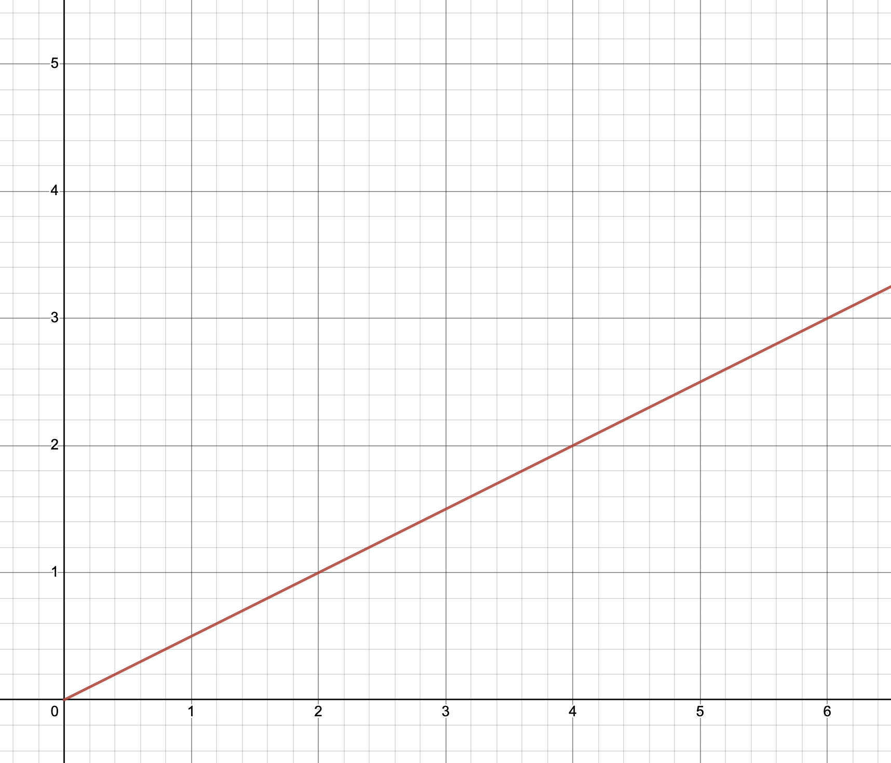
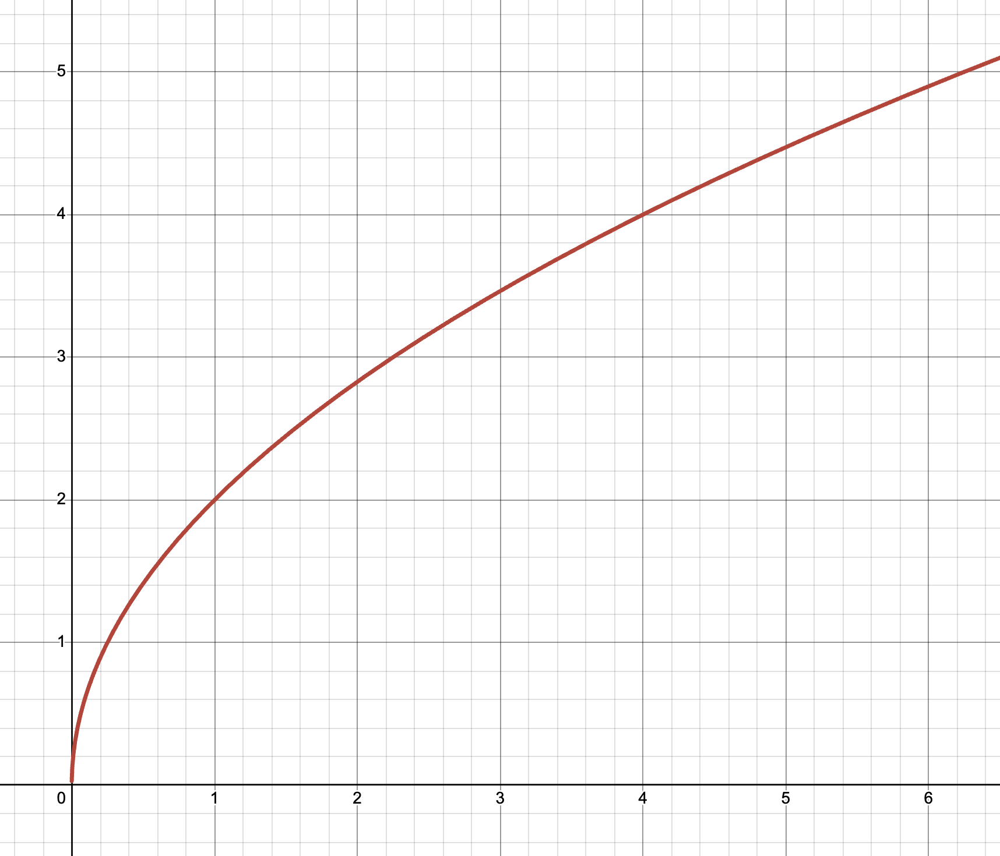

# Bonding Curves

Inverse bonding curves take inspiration from bonding curves, acting as their theoretical extension. A brief explainer on bonding curves is written for those unfamiliar with the concept.&#x20;

Bonding curves are an algorithmic pricing methodology that defines the relationship between the price and supply of an asset. They are generally paired with continuous tokens models - where assets can be minted and burnt on demand, instead of having a fixed supply schedule. Asset mints via bonding curves are performed following an algorithmically-set exchange rate, defined as a function of asset supply.&#x20;

A smart contract implementation of a bonding curve retains a pool of reserve assets (e.g. ETH) which is used to facilitate the mints and burns. Acting as the sole counterparty, the bonding curve mints new assets as it receives reserve assets and returns reserve assets as minted assets are burnt.&#x20;

Such assets usually (but not always) contain the following properties:&#x20;

* **Unbounded supply**: there exists no limit to the number of tokens that can be minted.&#x20;
* **Deterministic price**: the asset price is set from a predefined function of supply.&#x20;
* **Continuous price**: prices move smoothly without any jumps or breaks.&#x20;
* **Monotonic price**: the price changes in a way that it always increases with mints.
* **Instant liquidity**: assets can be minted or burnt instantaneously at any time.&#x20;

Bonding curves are often visualized using a price-to-supply graph. For example, a bonding curve of `price=1/6 * supply^2` visualizes as:&#x20;

<figure><figcaption></figcaption></figure>

The spot prices of assets and the amount of reserve assets required for their minting is all calculated based on the bonding curve, the amount of reserve assets required corresponding to the definite integral of the bonding curve from the supply prior to mint and to the supply following the mint (equivalent to the area below the bonding curve).&#x20;

On the above example of `price=1/6 * supply^2` at a starting supply of $$1$$, the minting of $$2$$ tokens leads to a spot price increase from $$0.166...$$ to $$1.5$$, and consumes $$1.444...$$ amount of reserve assets.&#x20;

Bonding curves can exist in various shapes and sizes:&#x20;

<figure><figcaption>
<code>price=1/2 * supply</code>
</figcaption></figure>

<figure><figcaption>
<code>price=2 sqrt(supply)</code>
</figcaption></figure>

<figure><figcaption>
<code>price=exp(supply/3)-1</code>
</figcaption></figure>

