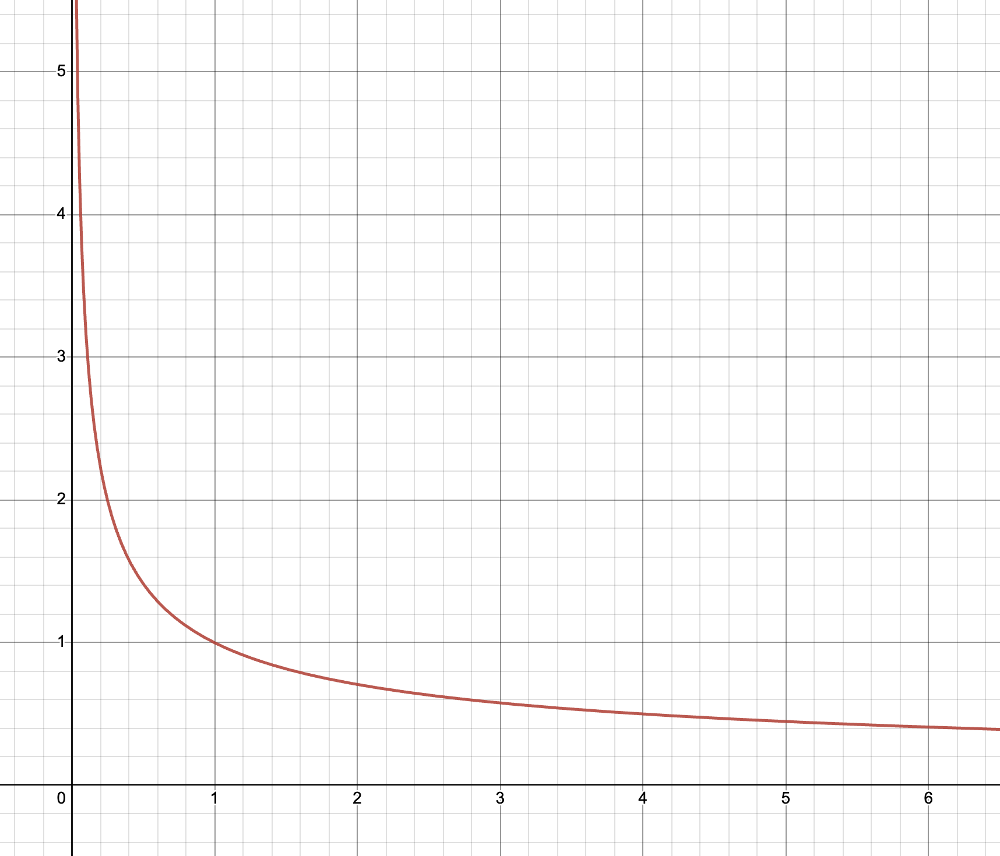

# Inverse Bonding Curves (IBCs)

Inverse bonding curves (IBCs) further extend the work done on regular bonding curves. Assets (e.g. ibETH) minted through bonding curves, named ibAssets, also generally follow the 5 characteristics of continuous tokens (unbounded supply, deterministic price, continuous price, monotonic price, instant liquidity), with the only change being that in contrast to regular bonding curves, where prices monotonically increase with asset mints, **prices on IBCs monotonically decrease as assets are minted**.&#x20;

ibAssets minted via IBCs start from an infinite (or otherwise high) price and and approach 0 as an infinite amount of tokens are minted. The resulting curve looks as if a regular bonding curve has been flipped upside-down, hence its name of inverse bonding curves.&#x20;

ibAssets display market properties never observed anywhere else. Unlike regular assets which increases in price as bought and decreases in price as sold, ibAssets strictly follow the inverse: its price decreases as bought and increases as sold.&#x20;

## Analysis

Although IBCs can exist in various forms (just like regular bonding curves), the analysis here centres around its polynomial variant of:&#x20;

$$
P=\frac{m}{S^k}
$$

With $$P$$ being the spot price at a minted supply of $$S$$, $$m$$ being a price multiplier value, and $$k$$ being the exponent determining the curve's curvature.&#x20;

<figure><figcaption></figcaption></figure>

Just like regular bonding curves, the area under IBCs also represent the amount of reserve assets (e.g. ETH) required for minting. This value, the integral of the IBC curve. comes out as (for minting from $$0$$ supply to $$x$$):&#x20;

$$
\int_0^x\frac{m}{x^k}dx=\frac{m{x}^{1-k}}{1-k}
$$

In order for the IBC to exist, it must only consume a finite amount of reserve assets to mint from $$0$$ supply to $$x$$. The exponent value $$k$$ thus must be in the range of:&#x20;

$$
0<k<1
$$

Where a $$k$$ value below $$0$$ yields a non-inverse regular bonding curve and a value above $$1$$ requires an infinite amount of reserve assets to mint any number of ibAssets thereby making its practical existence impossible.&#x20;
